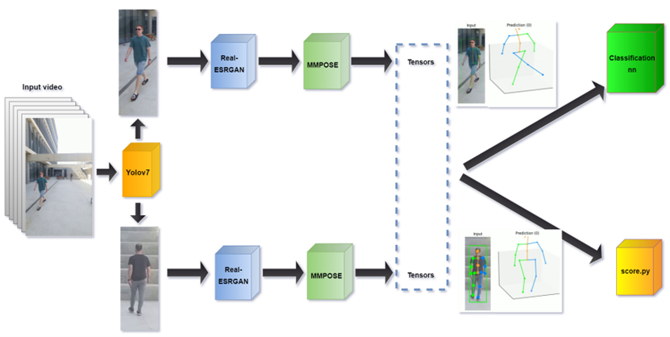
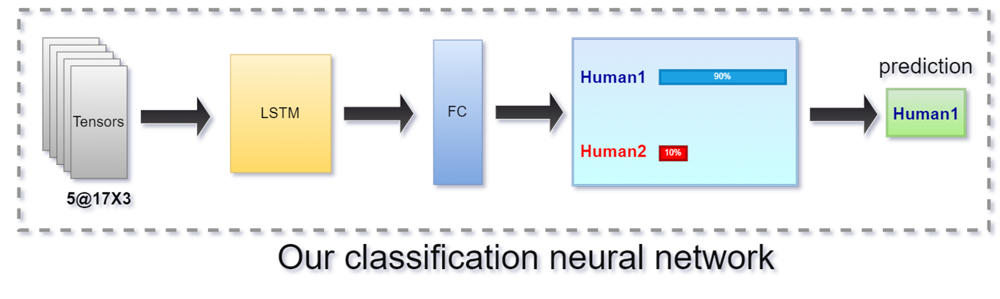

# GaitRecognition

Our project is divided into 3 main parts-

1.  Processing a video containing people going to edit tensors
    containing 17 three-dimensional points expressing the body of each
    person in each frame. This part aims to propose an improvement
    system for the MMPOSE model by using the Yolov7 object detection
    model and the Real-ESRGAN super-resolution model. This code is
    called using the main.py code

2.  Giving a score for the success of the products from the previous
    part. It receives text files containing a dictionary of tensors
    describing the 17 keypoints of a person in each frame, and returns a
    score between 0 and 1 (both prints to the screen and creates an
    Excel containing a score for each video)

3.  A classification network based on LSTM and Adam Optimizer for
    classification between people based on tensors of 17 keypoints
    describing a person in each frame of the test video

we want to show the 2 diagrams that describe the project: 
## Diagrams

  

[Diagram 1]{.image .placeholder
original-image-src="README_imgs/SYSTEM_block_diagram.png" original-image-title=""}
*SYSTEM_block_diagram*

  

[Diagram 2]{.image .placeholder
original-image-src="README_imgs/NN_block_diagram.png"
original-image-title=""} *block diagram of the Neural Network*

## Installation

we use 3 main models in order to process the input videos. the models
are: MMPOSE 0.29.0v - https://github.com/open-mmlab/mmpose/tree/dev-0.29
YOLOv7 - https://github.com/WongKinYiu/yolov7 Real-ESRGAN 0.3.0v -
https://github.com/xinntao/Real-ESRGAN

in addition, the installation of the following packages is needed: torch
\>= 1.10.1 nump \>= 1.19.5 opencv-python \>= 4.5.3.56 ast os subprocess
math

## Usage

for the main.py: the main.py gets two arguments - input video path and
GPU_id -\> python main.py {input video path} {GPU_id} it will be
required to change in the code the paths of the YOLOv7 , Real-ESRGAN and
MMPOSE as you have installed it

for the LSTM.py: the LSTM doesn't get any arguments, it only requires a
data folder that contains the data to train and test. in each epoch it
will output the weights for each iteration into a folder named weights

for the score.py: in the score.py code change the path in lines from the
form:

tensors_array0, reg0 = r_tensor_ff.read_func('%path') according to the
path of the text file that holds the tensors Of course, you can add and
download the desired amount of text files (a text file is tensors of a
person in each frame of the video), but it is important to make sure
that the numbering of the variables is from 0 to the last text file that
we want to examine. Then, in the loop below these lines, change the
range according to the number of text files we are examining.

For example, in the code we provided you with 8 text files numbered from
0 to 7, so the loop is up to range(8).

The code will print the score of each person described in the text file
and return an Excel file describing the same information.

## Dataset

the link to the dataset that we have created is:

https://drive.google.com/drive/folders/1FPbMNY_UB49B9oO2CFGJPduVpCXHremT?usp=sharing
